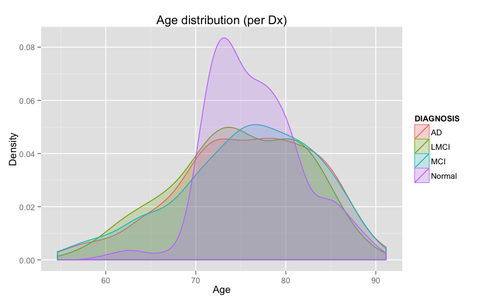
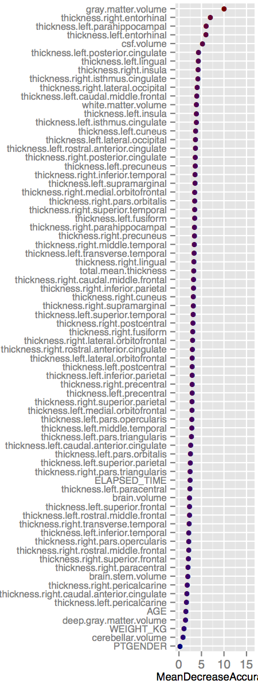
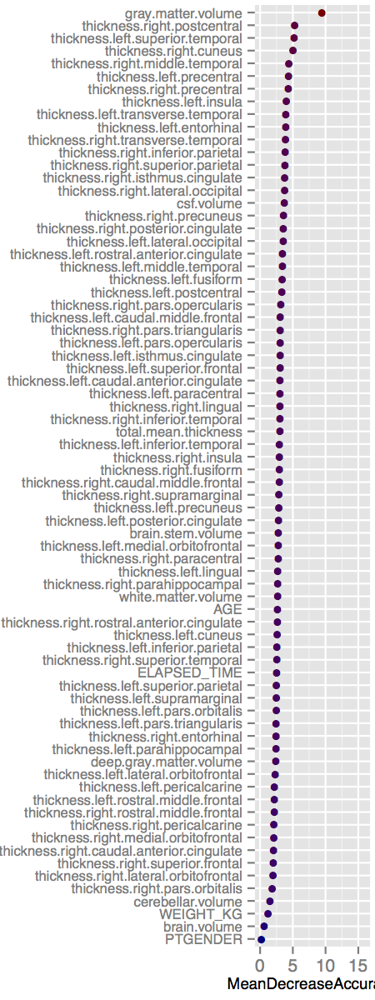
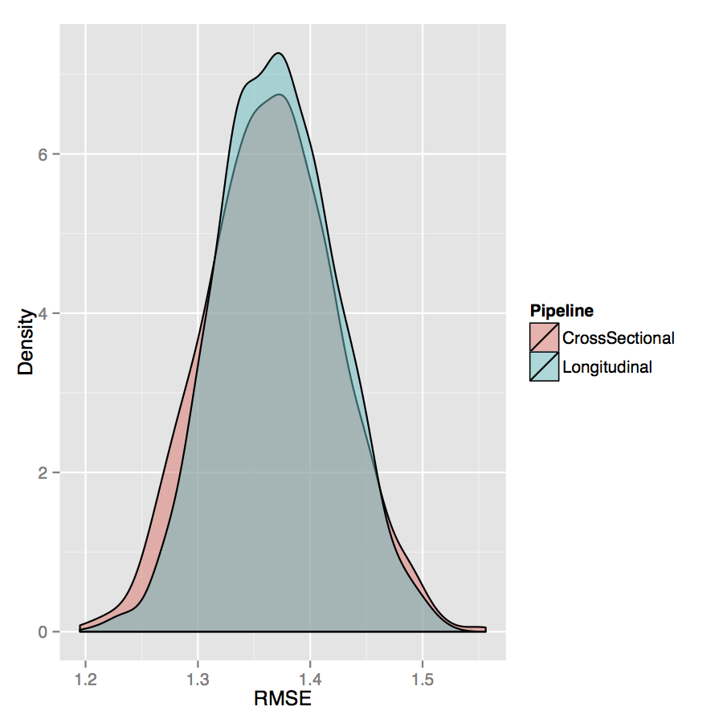

# Demographics

## Gender cardinality

```{r,results = 'asis', echo = F}
results <- read.csv( 'Data/adniThicknessResultsSubjectSpace.csv' )

results$FIELD_STRENGTH <- as.numeric( results$FIELD_STRENGTH )
results$DIAGNOSIS <- as.factor( results$DIAGNOSIS )

numberOfStudies <- nrow( results )
numberOfRecalledStudies <- length( which( results$RECALLED == 1 ) )  # 579

resultsEdited <- results[which( results$RECALLED == 0 ),]

cat( "Total number of studies = ", numberOfStudies, " (", numberOfRecalledStudies, " recalled).\n", sep = '' )
cat( "\nDemographics for non-recalled studies:\n" )

# accumulated demographics for each time point
timePoints <- c( 'ADNI1 Screening', 'ADNI1 Baseline', 'ADNI1/GO Month 6',
  'ADNI1/GO Month 12', 'ADNI1/GO Month 18', 'ADNI1/GO Month 24', 'ADNI1/GO Month 36' )
# other time points are "Unscheduled" (index = 495) and "No Visit Defined" (index = 670)

for( q in timePoints )
  {
  cat( "  \n   ", q, "\n", sep = '' )
  resultsEditedAtTimePoint <- resultsEdited[which( results$VISIT == q ),]

  numberOfMales <- length( which( resultsEditedAtTimePoint$GENDER == 'M' ) )
  numberOfFemales <- length( which( resultsEditedAtTimePoint$GENDER == 'F' ) )
  cat( "    = ", numberOfMales + numberOfFemales, sep = '' )
  cat( " (m=", numberOfMales, ", f=", numberOfFemales, ")\n", sep = '' )
  }
cat( "\n(Other time descriptors are \"Unscheduled\" (index = 495) and \"No Visit Defined\" (index = 670).\n" )

```

## Magnetic field strength

```{r,results = 'asis', echo = F}
results <- read.csv( 'Data/adniThicknessResultsSubjectSpace.csv' )

results$FIELD_STRENGTH <- as.numeric( results$FIELD_STRENGTH )
results$DIAGNOSIS <- as.factor( results$DIAGNOSIS )

numberOfStudies <- nrow( results )
numberOfRecalledStudies <- length( which( results$RECALLED == 1 ) )

resultsEdited <- results[which( results$RECALLED == 0 ),]

cat( "Total number of studies = ", numberOfStudies, " (", numberOfRecalledStudies, " recalled).\n", sep = '' )
cat( "\nDemographics for non-recalled studies:\n" )

# accumulated demographics for each time point
timePoints <- c( 'ADNI1 Screening', 'ADNI1 Baseline', 'ADNI1/GO Month 6',
  'ADNI1/GO Month 12', 'ADNI1/GO Month 18', 'ADNI1/GO Month 24', 'ADNI1/GO Month 36' )
# other time points are "Unscheduled" (index = 495) and "No Visit Defined" (index = 670)

for( q in timePoints )
  {
  cat( "  \n   ", q, "\n", sep = '' )
  resultsEditedAtTimePoint <- resultsEdited[which( results$VISIT == q ),]

  numberOfLowerFieldStrength <- length( which( resultsEditedAtTimePoint$FIELD_STRENGTH < 2.0 &
                                               resultsEditedAtTimePoint$FIELD_STRENGTH > 1.0 ) )
  numberOfUpperFieldStrength <- length( which( resultsEditedAtTimePoint$FIELD_STRENGTH < 4.0 &
                                               resultsEditedAtTimePoint$FIELD_STRENGTH > 2.0 ) )
  cat( "    ~1.5 T = ", numberOfLowerFieldStrength,
       ", ~3.0 T = ", numberOfUpperFieldStrength, "\n", sep = '' )
  }
```


## Initial diagnosis

```{r,results = 'asis', echo = F}
library( ggplot2 )

results <- read.csv( 'Data/adniThicknessResultsSubjectSpace.csv' )

results$FIELD_STRENGTH <- as.numeric( results$FIELD_STRENGTH )
results$DIAGNOSIS <- as.factor( results$DIAGNOSIS )
results$GENDER <- as.factor( results$GENDER )

numberOfStudies <- nrow( results )
numberOfRecalledStudies <- length( which( results$RECALLED == 1 ) )  # 579

resultsEdited <- results[which( results$RECALLED == 0 ),]

timePoints <- c( 'ADNI1 Screening', 'ADNI1 Baseline', 'ADNI1/GO Month 6',
  'ADNI1/GO Month 12', 'ADNI1/GO Month 18', 'ADNI1/GO Month 24', 'ADNI1/GO Month 36' )

uniqueIDs <- unique( resultsEdited$ID )
diagnosisLevels <- levels( resultsEdited$DIAGNOSIS )

naVector <- rep( NA, length( uniqueIDs ) )

resultsTimePoints <- data.frame( ID = uniqueIDs,
                                 SCREENING = naVector, BASELINE = naVector,
                                 MONTH_6 = naVector, MONTH_12 = naVector,
                                 MONTH_18 = naVector, MONTH_24 = naVector,
                                 MONTH_36 = naVector )
resultsDiagnosis <- data.frame( ID = uniqueIDs,
                                 SCREENING = naVector, BASELINE = naVector,
                                 MONTH_6 = naVector, MONTH_12 = naVector,
                                 MONTH_18 = naVector, MONTH_24 = naVector,
                                 MONTH_36 = naVector )

for( i in 1:length( uniqueIDs ) )
  {
  indices <- which( resultsEdited$ID == uniqueIDs[i] )
  for( j in indices )
    {
    resultsTimePoints[i, 1 + which( timePoints == resultsEdited$VISIT[j] )] = j
    resultsDiagnosis[i, 1 + which( timePoints == resultsEdited$VISIT[j] )] = diagnosisLevels[resultsEdited$DIAGNOSIS[j]]
    }
  }

# check to see if any subjects change diagnosis over the image acquisition period

initialDiagnosis <- c()
gender <- c()
age <- c()

for( i in 1:length( uniqueIDs ) )
  {
  subjectDiagnosis <- resultsDiagnosis[i,2:8]

  indices <- which( resultsEdited$ID == uniqueIDs[i] )

  initialDiagnosis[i] <- NA
  gender[i] <- resultsEdited$GENDER[indices[1]];
  age[i] <- resultsEdited$AGE[indices[1]]
  for( j in 1:length( subjectDiagnosis ) )
    {
    if( !is.na( subjectDiagnosis[j] ) && is.na( initialDiagnosis[i] ) )
      {
      initialDiagnosis[i] <- unlist( subjectDiagnosis[j] )
      } else if( !is.na( subjectDiagnosis[j] ) && initialDiagnosis[i] != subjectDiagnosis[j] ) {
      cat( as.character( resultsDiagnosis$ID[i] ), " -> ", unlist( subjectDiagnosis ), "\n" )
      }
    }
  }

diagnoses <- c( 'Normal', 'MCI', 'LMCI', 'AD' )

for( dx in diagnoses )
  {
  subjects <- which( initialDiagnosis == dx )
  numberOfMales <- length( which( gender[subjects] == 1 ) )
  numberOfFemales <- length( which( gender[subjects] == 2 ) )

  cat( "Number of ", dx, " = ", length( subjects ), " (m=", numberOfMales, ", f=", numberOfFemales, ")", "\n\n", sep = '' )
  }

initialDiagnosisDF <- data.frame( AGE = age, GENDER = gender, DIAGNOSIS = initialDiagnosis )

png( filename = "./Figures/initialDiagnosis.png", width = 8, height = 5, units = "in", res = 100 )
diagnosisPlot <- ggplot( initialDiagnosisDF, aes( AGE, ..density.., colour = DIAGNOSIS, fill = DIAGNOSIS ) ) +
  labs( x = "Age", y = "Density", title = "Age distribution (per Dx)" ) +
  geom_density( alpha = 0.2 )
print( diagnosisPlot )
x <- dev.off()
```

## Age distribution (per Dx)




# CDRSB prediction w/ random forests

## Cross sectional importance plot




## Longitudinal importance plot



## RMSE differences


